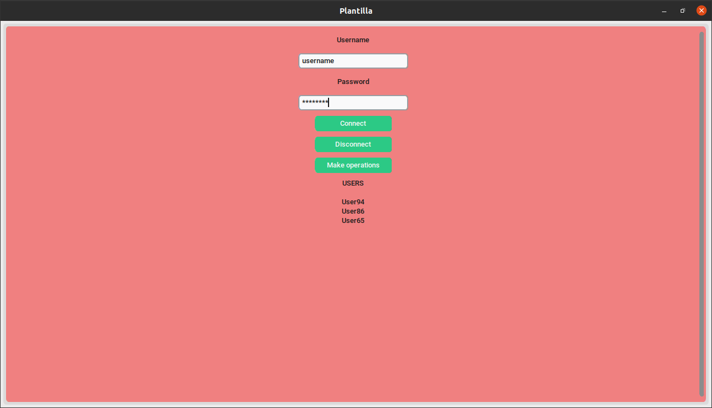

# Template python customtkinter mongodb

## Versiones de herramientas utilizadas:
- ***git: 2.25.1***
- ***pip: 24.2***
- ***python: 3.8.10***

## Temas
***
### Aplicacion 


***
### Organizacion 
- `project/app`
    - Aplicacion local
- `project/app_docker`
    - Aplicacion encapsulada con Docker
- `project/db_docker`
    - Conjunto de replicas MongoDB local (cluster)

Script para automatizar todo el proceso de lanzamiento de servicios Docker-Compose: 
- `project/app.sh`
    - Para el lanzamiento de  servicios en:
        - `app_docker`
        - `db_docker`

Archivo `.dockerignore` para ignorar archivos y directorios, ya que el directorio de contexto para la construccion de imagenes es `project/`. 

***
### Nombre de la plantilla
El nombre de la plantilla se encuentra en los siguientes archivos (por si se desea modificar el nombre):
- `project/app.sh`
- `project/app_docker/docker-compose.yaml`
- `project/db_docker/docker-compose.yaml`

***
### `project/app`
### ***Entorno virtual Python***
Instalar paquetes necesarios de Python:
- Instalar python:
    - `sudo apt install python3.8`
- Instalar paquete venv (para crear entornos virtuales):
    - `sudo apt install python3.8-venv`

Comandos entorno virtual:
- Crear entorno virtual:
    - `python3.8 -m venv app_env`
- Activar entorno virtual:
    - `source app_env/bin/activate`
- Desactivar entorno virtual:
    - `deactivate`
- Eliminar entorno virtual:
    - `rm -rf app_env`
- Instalar dependencias a partir del archivo requirements.txt:
    - `pip install -r ../app_docker/requirements.txt`

Una vez activado el entorno virtual, la aplicacion se ejecuta con el siguiente comando:
- `python3.8 app.py`

### ***Variables de entorno***
En esta carpeta debe existir un archivo `.env` con la siguiente estructura:
```
MONGO_INITDB_DATABASE=db
MONGO_REPLICA_SET_NAME=dbrs
```
> Debe coincidir con las variables del archivo `.env` que se encuentra en `project/db_docker`.

***
### `project/app_docker`
### ***Archivo de dependencias de la aplicacion***
Crear archivo de dependencias del entorno virtual:
> Es importante tener activado el entorno virtual y estar situados en el directorio `project/app`.

> Este archivo es necesario a la hora de construir la imagen Docker de la aplicacion.

- `pip freeze > ../app_docker/requirements.txt`

### `project/db_docker`
### ***Conjunto de replicas MongoDB local (cluster)***
La base de datos local se configura como un cluster de 3 instancias MongoDB. Una instancia adicional es la que se encarga de esta configuracion, la cual muere despues de eso.

### ***MongoDB Atlas***
En caso de querer conectar con una base de datos en la nube, una buena opcion es [MongoDB Atlas](https://cloud.mongodb.com/). Pasos a seguir:
1. Crear una cuenta
2. Crear base de datos
3. Configurar el acceso a la red en el apartado `Security -> Network Access` 
4. Configurar los usuarios en el apartado `Security -> Database Access`
5. En la aplicacion de Python cambiar la cadena de conexion

### ***Variables de entorno***
En esta carpeta debe existir un archivo `.env` con la siguiente estructura:
```
TZ=America/Mexico_City
MONGO_INITDB_ROOT_USERNAME=root_username
MONGO_INITDB_ROOT_PASSWORD=root_password
MONGO_INITDB_USERNAME=username
MONGO_INITDB_PASSWORD=password
MONGO_INITDB_DATABASE=db
MONGO_REPLICA_SET_NAME=dbrs
```
> Se puede cambiar el valor de cada variable si asi se desea.


